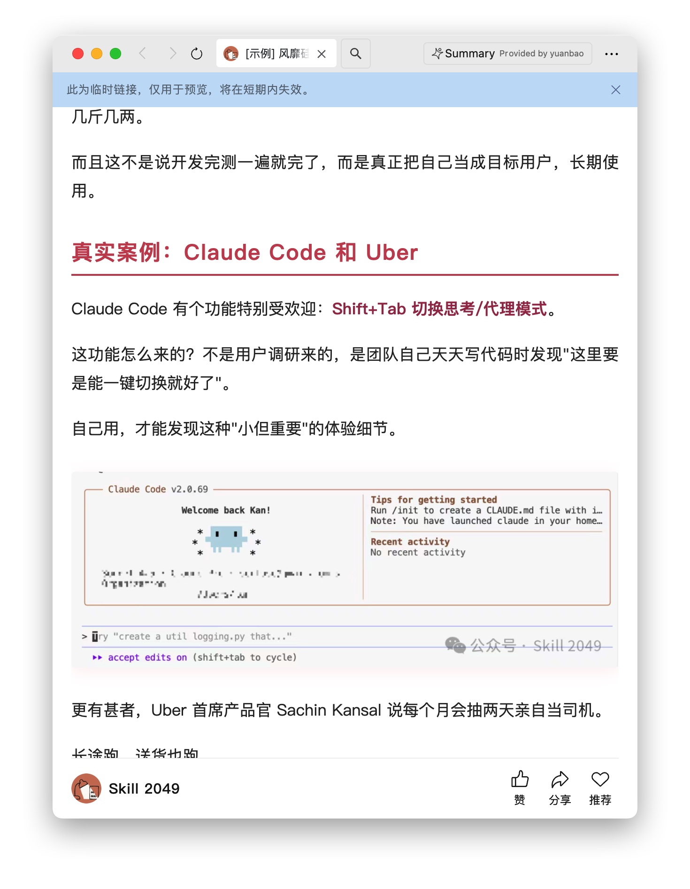

# md2rich

Markdown 转富文本 HTML 工具，支持多主题，专为微信公众号等富文本平台设计。

## 特性

- ✨ **多主题支持**：内置多个精美主题，可自由切换
- 🎨 **样式内联**：自动将 CSS 转换为内联样式，完美兼容微信公众号
- 💻 **代码块**：优雅的代码展示样式
- 📊 **扩展语法**：支持表格等 GitHub Flavored Markdown 特性
- 🖼️ **图片支持**：完整支持 SVG 矢量图、PNG、JPG 等所有图片格式
- 🚀 **简单易用**：命令行工具，一行命令完成转换

## 安装

```bash
cd md2rich
npm install
```

## 快速开始

### 基本用法

```bash
# 转换 Markdown 并输出 HTML
# -i: 生成内联 HTML（适合富文本编辑器，无 DOCTYPE 等标签）
node index.js examples/demo.md -t elegant-rose -i -o examples/demo-output.html
```

### 查看可用主题

```bash
# 方式 1
node index.js themes

# 方式 2
node index.js input.md -l -o output.html
```

## 命令行选项

```
Usage: md2rich <input> [options]

Arguments:
  input                   输入的 Markdown 文件路径

Options:
  -V, --version           显示版本号
  -o, --output <file>     输出 HTML 文件路径（必需）
  -t, --theme <theme>     主题名称 (默认: wechat-default)
  -i, --inline-only       只生成内联 HTML（无 DOCTYPE 等标签，推荐用于富文本编辑器）
  -s, --sanitize          清理 HTML 以获得更好的平台兼容性
  -l, --list-themes       列出所有可用主题
  -h, --help              显示帮助信息
```

## 主题

### 内置主题

| 主题 | 风格 | 适用场景 | 特色 |
|------|------|---------|------|
| **wechat-default** | 清新简洁 | 通用文章、教程 | 蓝色系、现代无衬线字体 |
| **elegant-rose** ✨ | 现代优雅 | 品牌文章、专业内容 | 玫瑰红色系、苹方字体、层次分明 |
| **wechat-minimal** | 优雅极简 | 品味内容、思考文章 | Baskerville 字体、淡橙强调、macOS Terminal 代码块 |

#### elegant-rose 主题亮点 ✨

- 🌹 **玫瑰红配色**：醒目但优雅的玫瑰红色系，现代而不刺眼
- 🎨 **标题层次**：6 级标题使用不同深浅的红色，层次分明
- ✍️ **苹方字体**：PingFang SC 无衬线字体，清晰现代
- 💪 **加粗设计**：所有标题均采用加粗设计，视觉冲击力强
- 🎯 **专业感**：适合品牌文章、产品介绍等专业内容



#### wechat-minimal 主题亮点

- 🎨 **优雅字体**：Baskerville 衬线体，传承经典排版美学
- 🟠 **淡橙强调**：加粗文字使用温暖的淡橙色 #F97316，优雅而有活力
- 💻 **Terminal 代码块**：模拟 macOS Terminal 窗口，带标题栏和三色控制按钮
- ⚪ **极致留白**：大量空白营造呼吸感，标题间距达 56-64px
- 🎯 **克制装饰**：简洁线条分隔，不使用多余元素
- 📐 **精致间距**：每个元素的间距都经过精心考量

### 自定义主题

1. 在 `themes/` 目录下创建新的 CSS 文件
2. 参考现有主题编写样式规则
3. 使用 `-t` 参数指定你的主题名称

```bash
# 创建自定义主题
echo ".markdown-body { color: #333; }" > themes/my-theme.css

# 使用自定义主题
node index.js input.md -t my-theme -c
```

## 工作流程

### 微信公众号发布流程

1. **准备 Markdown 文档**
2. **转换为 HTML**：
   ```bash
   node index.js article.md -t elegant-rose -i -o output.html
   ```
3. **在浏览器中打开** `output.html`
4. **全选并复制**（Cmd+A / Ctrl+A，然后 Cmd+C / Ctrl+C）
5. **粘贴到微信公众号编辑器**（图片会自动识别和上传）
6. 发布

**提示**：使用 `-i` 参数生成的内联 HTML 更适合富文本编辑器，样式会被完整保留。

## 技术栈

- [marked](https://marked.js.org/) - Markdown 解析器
- [juice](https://github.com/Automattic/juice) - CSS 内联转换
- [commander](https://github.com/tj/commander.js) - 命令行工具
- [chalk](https://github.com/chalk/chalk) - 终端样式

## 示例

`examples/demo.md` 展示了所有支持的 Markdown 特性：
- 标题、段落、列表
- 代码块
- 表格
- 引用
- 图片（包括 SVG 矢量图）
- 链接

### 运行示例

```bash
# 使用 wechat-default 主题
node index.js examples/demo.md -t wechat-default -i -o output.html

# 使用 elegant-rose 主题（推荐）
node index.js examples/demo.md -t elegant-rose -i -o output.html

# 使用 wechat-minimal 主题
node index.js examples/demo.md -t wechat-minimal -i -o output.html
```

生成 HTML 后，在浏览器中打开，全选复制，然后粘贴到富文本编辑器即可。

## 图片支持

md2rich 完整支持各种图片格式，**本地图片会自动转换为 base64 内嵌**，确保复制粘贴时图片能正常显示。

### 支持的格式

- **SVG 矢量图**：完美支持，保持清晰度，适合图标和图表
- **PNG/JPG**：常规位图格式
- **GIF/WebP**：支持动图和现代图片格式
- **在线图片**：支持通过 URL 引用的图片（保持 URL）

### 图片处理机制

- **本地图片**（如 `images/icon.svg`）→ 自动转换为 base64 内嵌 ✨
- **在线图片**（如 `https://...`）→ 保持原 URL
- **复制粘贴**：微信公众号编辑器会自动识别并上传图片到微信服务器

### 使用示例

```markdown
<!-- 本地 SVG 图片 - 会自动转为 base64 -->


<!-- 在线图片 - 保持 URL -->


<!-- 本地位图 - 会自动转为 base64 -->

```

### 优势

- ✅ **一键复制粘贴**：本地图片内嵌后，复制粘贴即可使用
- ✅ **自动上传**：微信编辑器会自动识别并上传到微信服务器
- ✅ **无需手动处理**：不需要先上传图片到图床
- ✅ **完整支持**：SVG、PNG、JPG、GIF 等所有常见格式

`examples/demo.md` 中包含了图片的实际使用示例。

## 兼容性

### 微信公众号

- ✅ 样式完全内联，无需外部 CSS
- ✅ 移除不兼容的标签和属性
- ✅ 本地图片自动转 base64，复制粘贴即可使用
- ✅ 微信编辑器自动识别并上传图片
- ✅ 浏览器复制粘贴保留格式

### 其他富文本平台

- ✅ 支持大多数支持 HTML 的富文本编辑器
- ✅ 知乎、掘金、简书等平台
- ✅ Microsoft Word、Google Docs
- ✅ Notion、Confluence 等协作工具

### 使用建议

1. 生成 HTML 文件后在浏览器中打开
2. 使用浏览器的"全选"和"复制"功能
3. 粘贴到目标富文本编辑器
4. 浏览器会自动保留 HTML 的格式和样式

## 许可证

MIT

## 贡献

欢迎提交 Issue 和 Pull Request！
